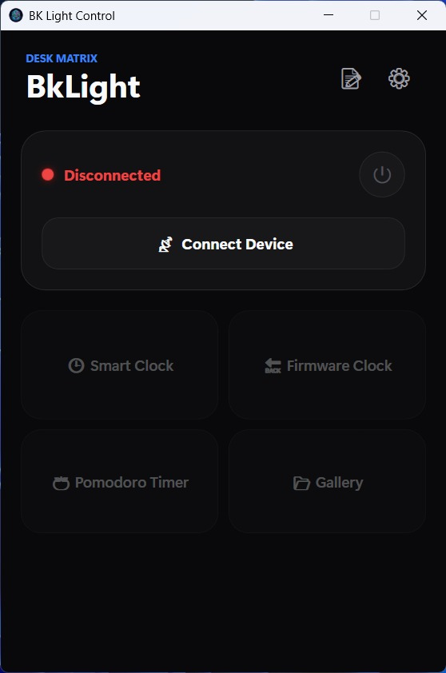

# BkLightDesk

A modern, high-performance .NET 10 WPF desktop controller for 32x32 RGB LED matrix displays over Bluetooth Low Energy (BLE).

## App Preview



---

## 🎯 The "Why" (Motivation)

After receiving a 32x32 RGB LED matrix as a gift, I quickly hit the boundaries of its closed ecosystem. The official mobile companion app was rigid, limited in functionality, and lacked desktop integration. The hardware had immense potential as an interactive desk display, but it was locked behind an undocumented proprietary interface.

Rather than accepting these constraints, I decided to reverse-engineer the communication pipeline and engineer a dedicated desktop workstation companion from scratch.

---

## 🧗 Engineering Challenges & Reverse Engineering

Building **BkLightDesk** involved moving from black-box hardware analysis to a stable binary streaming architecture:

### 1. Reverse-Engineering the BLE Protocol

The display relies on a proprietary protocol without public documentation.

* **Approach:** Building on initial bypass discoveries by [Pupariaa](https://github.com/Pupariaa/Bk-Light-AppBypass), I deployed BLE packet sniffers to analyze raw traffic generated by the official mobile application.
* **Outcome:** Mapped out the undocumented GATT service (`0xFA00`) and characteristic (`0xFA02`), identified magic byte packet headers, validated checksum routines, and determined the hardware’s non-linear brightness PWM curves.

### 2. Host-Driven Streaming vs. Firmware Autonomy

A core architectural dilemma was managing what runs directly on the microcontroller versus what is computed by the PC:

* **The Constraint:** The device natively executes a few pre-baked firmware routines (such as default clocks), but custom interactive widgets (like a customized Pomodoro workflow or dynamic layouts) require active real-time frame streaming.
* **The Solution:** Built a dual-layer pipeline:
* **Real-time Host Streaming:** Encodes 32x32 visual frames into optimized PNG buffers and streams them via chunked BLE writes while the application is active.
* **Firmware Fallback:** Gracefully restores native standalone firmware states when the desktop application closes.


### 3. Non-Volatile Storage & Persistence (WIP)

Packet analysis revealed commands capable of writing directly into the matrix's onboard flash memory, allowing custom graphic persistence across reboots without an active host connection. Fully mapping this internal memory structure is currently under active experimentation.

---

## ✨ Features

* **Bento Box Modern UI:** Clean, modular WPF interface designed for quick access and desktop aesthetic.
* **Smart Desk Clock:** Multi-style time displays with synchronizable hardware modes.
* **Integrated Pomodoro Timer:** Configurable work/break intervals with visual cues and optional audio alerts.
* **Live Canvas & Media Cast:** Direct rendering of static visuals and animated GIFs optimized for 32x32 resolution.
* **Direct Hardware Control:** Non-linear brightness calibration, power toggles, and BLE link health monitors.

---

## 🏗️ Architecture & Protocol Stack

* **Framework:** .NET 10 (WPF / C#)
* **Connectivity:** Bluetooth Low Energy (Windows.Devices.Bluetooth GATT APIs)
* **Binary Packaging:** MTU-aware fragment chunking with custom binary packet framing.

For an in-depth breakdown of packet headers, MTU negotiation, and characteristic mappings, refer to the [Technical Documentation](https://www.google.com/search?q=technical-documentation.md).

---

## 🚀 Getting Started

### Prerequisites

* Windows 10 (version 1903+) or Windows 11
* Bluetooth 4.0+ BLE-capable adapter
* Compatible 32x32 RGB LED Matrix running the `0xFA00` BLE service

### Installation

#### Installer (Recommended)

Download the latest `BkLightDesk-Setup.exe` from the [Releases](https://www.google.com/search?q=https://github.com/yourusername/bklightdesk/releases) tab and follow the guided setup wizard.

#### Build from Source

```bash
# Clone the repository
git clone https://github.com/comiago/bklightdesk.git
cd bklightdesk

# Restore and build the project
dotnet restore
dotnet build -c Release

```

---

## 🤝 Credits & Acknowledgments

* [Pupariaa/Bk-Light-AppBypass](https://github.com/Pupariaa/Bk-Light-AppBypass) — Foundational exploration that demonstrated the feasibility of third-party hardware interaction.
* Protocol packet capture, GATT structure decoding, and .NET desktop implementation by Giacomo.

---

## 📄 License

Distributed under the MIT License. See `LICENSE` for details.
